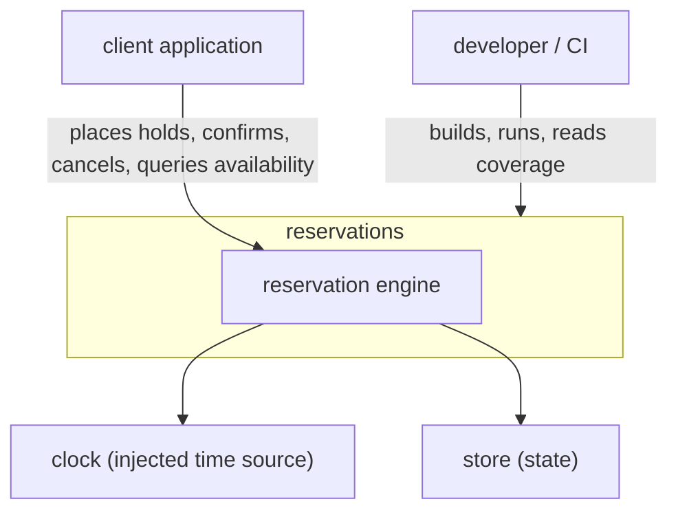
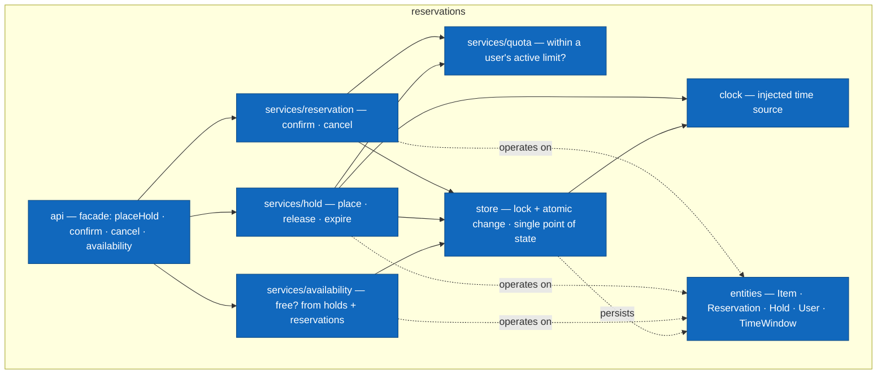

# Architecture and constraints

This document is the framing for the reservation engine.
It is narrative.
It explains the shape.
The rules it states are enforced by the architecture tests described below; the rest is context for the decisions.

## Shape

The system is a single Java library, `reservations`: a set of domain entities, the services that operate on them, and a store that holds their state.

An `Item` is a bookable unit.
A user places a `Hold` to reserve an item tentatively for a `TimeWindow`, then confirms it into a `Reservation` or lets it expire.
Availability for a window is not stored; it is computed from the active holds and confirmed reservations that bear on it (ADR-0003).
A quota bounds how much a user may hold and reserve at once.

The services own the decisions — whether a window is free, whether a hold may be placed, whether a confirmation is within quota.
The store owns the state and the guarantees around changing it.
The entities own nothing but their shape.

## Enforcement, in layers

Boundaries are enforced by architecture tests (ADR-0005, ArchUnit), stated as mechanically checkable rules: api classes may depend only on service interfaces and DTOs and may not access store classes; services may depend on entities while entities may not depend on service, api, or store packages; and only store classes may call declared state-mutating methods.
These are structural rules; ArchUnit does not inspect method bodies to judge whether the api "carries decision logic" — the dependency restriction is the enforceable proxy for that intent.

Invariants — no item is ever double-booked, a confirmation is atomic, a user's active count never exceeds quota — are properties of the whole system rather than of any one method.
Each is pinned by a test that attempts to violate it and asserts rejection.

## Code organization

```
io.example.reservations
├── api           facade: placeHold · confirm · cancel · availability
├── services
│   ├── reservation   confirm · cancel
│   ├── hold          place · release · expire
│   ├── availability  free? computed from holds + reservations
│   └── quota         within a user's active limit?
├── store         the single point of state change
├── clock         injected time source
└── entities      Item · Reservation · Hold · User · TimeWindow
```

Services depend on entities; entities depend on nothing above them (`api`, `services`, `store`).
Entities may hold plain values — including a `Hold`'s expiry `Instant` — but never read the `clock`: they carry clock-*derived* values passed in, so `clock` is a peer, not a layer above them, and the entities-depend-on-nothing rule does not name it.
The api depends only on service interfaces and DTOs and delegates to services.
Only `store` mutates persisted state.
Those boundaries are enforced by architecture tests (ADR-0005) as structural dependency and access rules.

The api holds no reference to `store` and constructs nothing itself.
The object graph is assembled by constructor injection at a composition root **outside** the enforced packages — the library's entry point wires store → services → engine and hands the facade only the services it needs.
That is how "api may not access store" stays satisfiable without a factory inside `api`.

## Nullness

Every package states its null-handling in the type system rather than by convention.
Each package ships a `package-info.java` annotated `@NullMarked` (JSpecify), so within the engine a reference is non-null by default and anything that may be absent is marked `@Nullable` exactly where it occurs.
Absence becomes a decision stated in the type, not something the reader has to carry in their head.

An ArchUnit test enforces that every package that contains classes carries a `@NullMarked` `package-info.java`, alongside the boundary rules above.
A pure grouping package that holds only subpackages and no classes of its own (for example `services`) has nothing to null-mark and carries none.

## Runtime

At runtime the engine talks to three things: the client application that drives it, an injected `clock` (ADR-0004), and its `store`.
Everything else — the build, the tests, the compiler — is a construction-time concern and belongs in "how this system is built", not in a view of what the running system interacts with.

## Atomicity and contention

The store is the single point of state change (ADR-0002).
Every operation that changes state does so through the store, which serializes the change and guarantees it is atomic.

An operation serializes on the item it touches, so two operations on the same item never interleave.

## Rejections

A rejected operation — an unavailable item, an expired hold, a non-owner cancel or release, an over-quota claim, an invalid hold set — is signalled by throwing a **dedicated unchecked exception** named for the reason, never an in-band empty or `false` result.
One exception type per rejection reason.
Because every state change goes through the store atomically (ADR-0002), a rejected operation leaves the store untouched.

## Views

The diagrams below are views.
They are not the checked truth; the architecture tests and the ADRs are.

### C1 — context



### C3 — components


